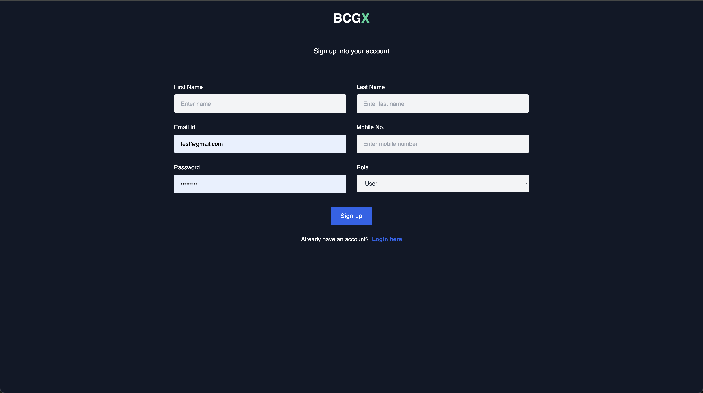
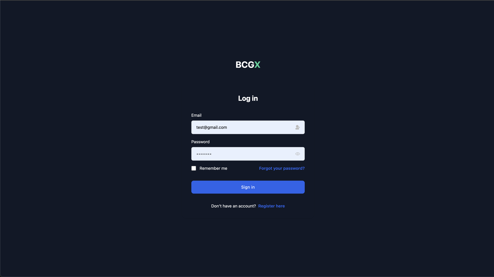
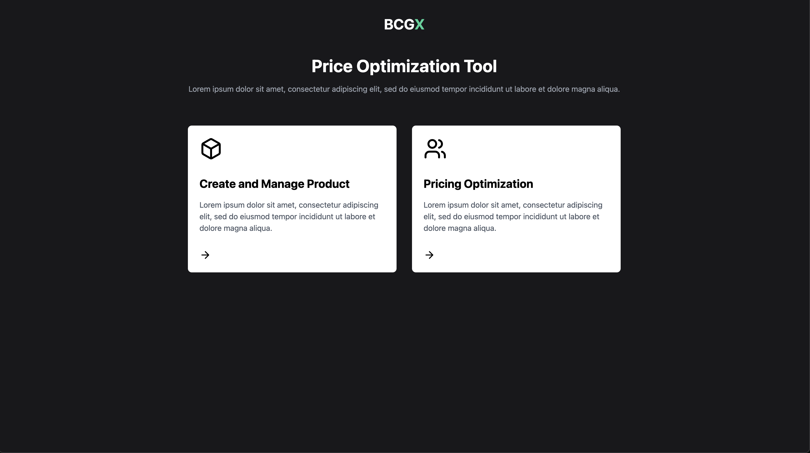
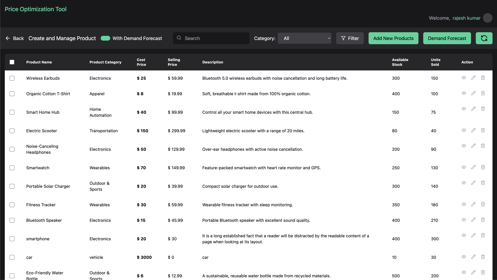
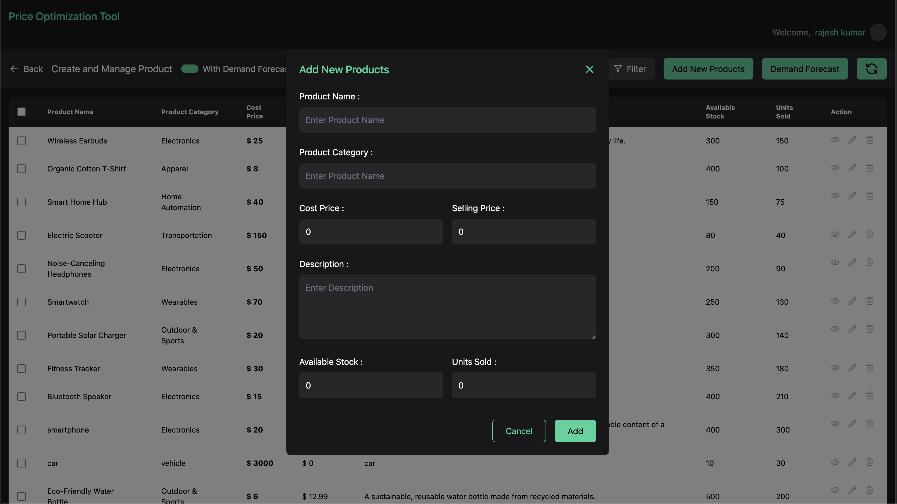
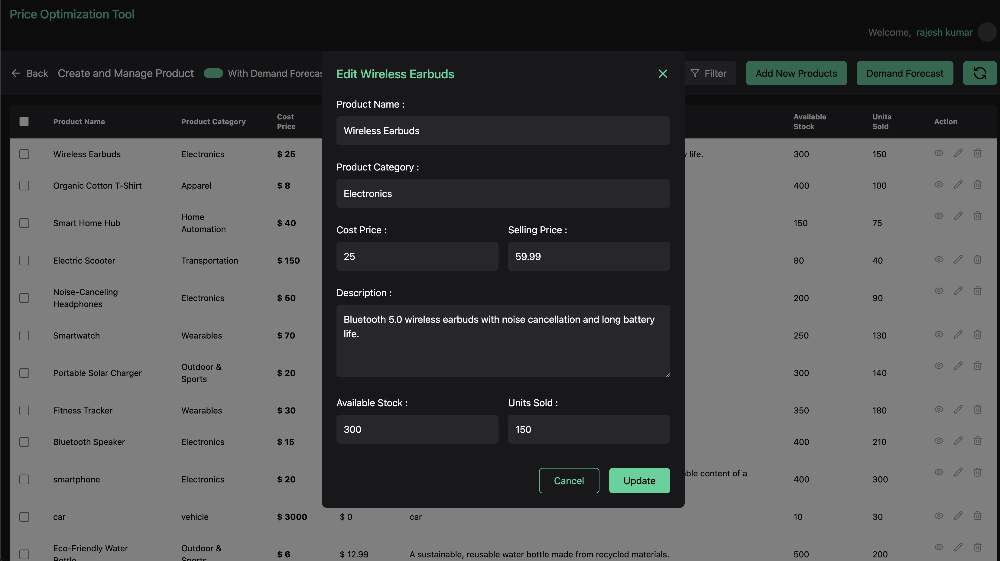
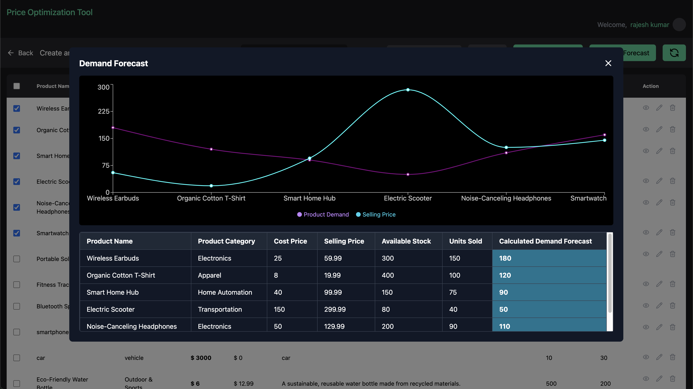
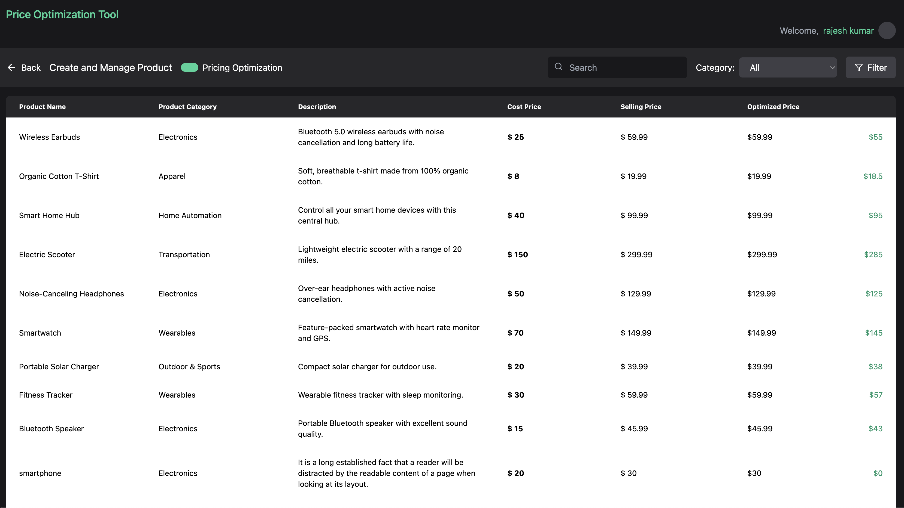

<h2 align="center">
  Price Optimization 
</h2>

 

 &nbsp;
 &nbsp;
 &nbsp;

<h3 align="center">
    🔹
    <a href="https://github.com/RAJESH7500/personal-portfolio/issues">Report Bug</a> &nbsp; &nbsp;
    🔹
    <a href="https://github.com/RAJESH7500/personal-portfolio/issues">Request Feature</a>
</h3>

## Built With

This project was built using these technologies.

- React.js
- Node.js
- tailwindcss
- react charts

## Features

**📖 Multi-Page Layout**

**🎨 Styled with Tailwind css**

## Getting Started

Clone down this repository. You will need `node.js` and `git` installed globally on your machine.

## 🛠 Installation and Setup Instructions

1. Installation: `npm install`

2. In the project directory, you can run: `npm start`

Runs the app in the development mode.\
Open [http://localhost:3000](http://localhost:3000) to view it in the browser.
The page will reload if you make edits.

## Usage Instructions

Open the project folder and Navigate to `/src/components/`.  
You will find all the components used and you can edit your information accordingly.

# Project live link
Open [https://price-optimization-frontend.onrender.com/manage-product](https://price-optimization-frontend.onrender.com/manage-product) to view it in browser

# Help
if chrome browser give the cors error, try to open the crome by disabling chrome cors with command
## OSX
open -n -a /Applications/Google\ Chrome.app/Contents/MacOS/Google\ Chrome --args --user-data-dir="/tmp/chrome_dev_test" --disable-web-security
## Linux
google-chrome --disable-web-security

## Windows
chrome.exe --user-data-dir="C://Chrome dev session" --disable-web-security

# Website view

  <h1>Register page</h1>
  
  <h1>Login page</h1>
  
  <h1>Dashboard page</h1>
  
  <h1>Demand Forecast page</h1>
  
  <h1>Add Product Modal</h1>
  
  <h1>Edit Product Modal</h1>
  
  <h1>Demand forecast Modal</h1>
  
  <h1>Optimized Price page</h1>
  

